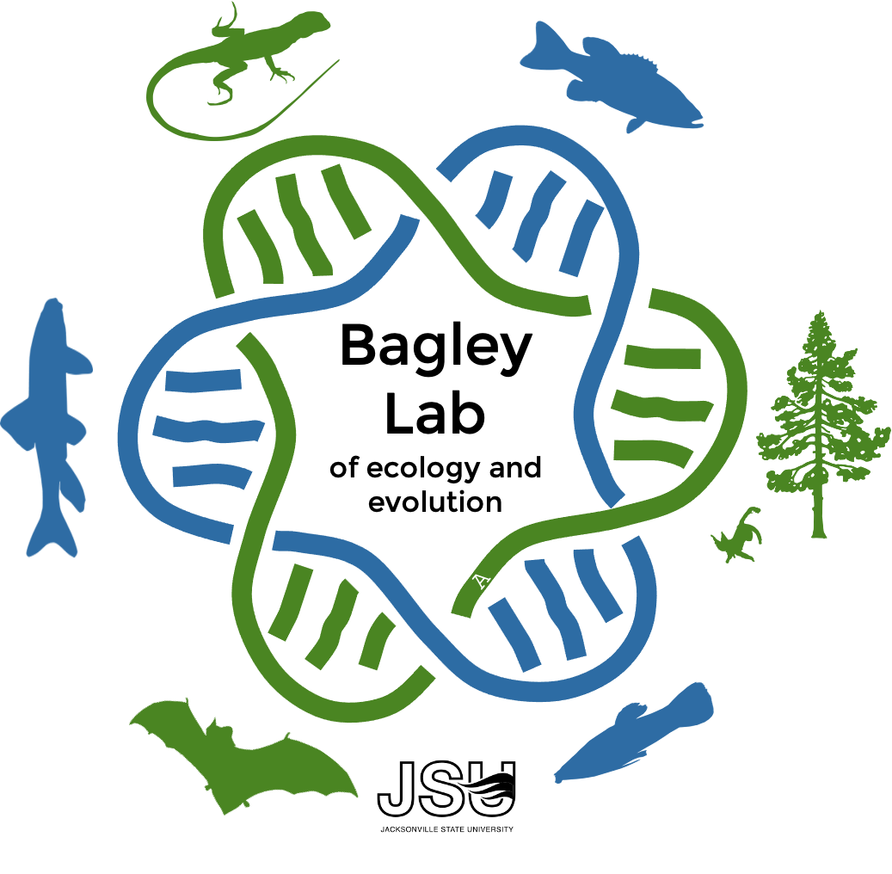

# Welcome to the Bagley Lab!
{: .display-4}
We are part of the [Department of Biology](http://www.jsu.edu/biology/) at [Jacksonville State University](http://jsu.edu), which is located in the Southern Appalachian Mountains of northern Alabama.
{: .welcomefont}

{:style="max-width: 100%; height: auto;"} <!-- alt img: Bagley_Lab_dna_terr_aquat_gbb_trans_216x207.5mm.png (1.1 Mb) -->

<!-- **Ecological and Evolutionary Genetics** // NEW: **Evolutionary Processes and Ecological Applications** -->
{: .welcomefont}

<!-- Research in the lab is broadly focused on integrating genomics, ecological data, and computer modeling to reconstruct the evolutionary histories of species and populations. Questions about species, their relationships, and their past, present, and future responses (e.g. distributional shifts) to climate change and human impacts are especially of interest. Current projects focus on conservation genomics, evolutionary ecology, phylogeography/phylogenomics, ecological niche modeling, and the genetic architecture of adaptation in terrestrial and aquatic ecosystems of North America and the Neotropics. -->
Research in the lab is broadly focused on integrating genomics, ecological data, and computer modeling to address problems in molecular ecology, distributional ecology, conservation, and biodiversity science. Questions about species, their relationships, and their past, present, and future responses (e.g. distributional shifts) to climate change and human impacts are especially of interest. Current projects focus on ecological niche modeling, conservation genomics, evolutionary ecology, phylogeography/phylogenomics, and the genetic architecture of adaptation in terrestrial and aquatic ecosystems of North America and the Neotropics.
{: .welcomefont}

We are also interested in biological assessment (e.g. biomonitoring, fisheries research) and community ecology of the diverse fish assemblages of Alabama and the southeastern US. We are working with state agencies to develop projects in this applied arena.
{: .welcomefont}

We are located in McGee Science Center, in the Science Complex at JSU.
{: .welcomefont}

<!--We are the "Bagley Lab", or more formally the "Ecological and Evolutionary Genetics Laboratory (EEGL)", and we are part of the [Department of Biology](http://www.jsu.edu/biology/) at [Jacksonville State University](http://jsu.edu), which is located in the Southern Appalachian Mountains of northern Alabama.-->
